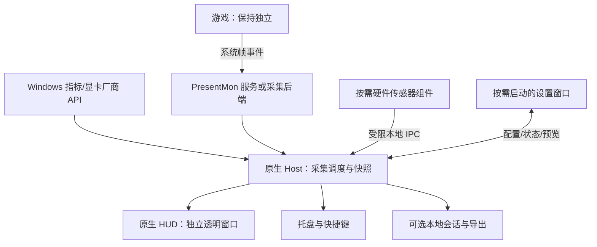

# Windows 游戏内监控方案 — 项目名称待定

> 版本：0.5 / 2026-09-28（开始开发后的实施记录）  
> 状态：用户已明确要求“开始开发”。下面保留原方案和备选路线，并记录当前实际完成情况；尚未达到个人可用版验收。  
> 工作名称：游戏仪表 · GameGauge。名称仍可调整，代码与资产暂以此命名。

### 当前实施状态（2026-09-28）

- 已建立 C++20 / Win32 / D3D11 / DirectComposition / Direct2D 工程。全 C++ 设置页实际选择 **S3b**：Win32 + Direct2D/DirectWrite，按需启动；省去 Windows App SDK 运行时，同时需要后续补齐键盘导航与读屏支持。
- 已实现托盘、菜单、快捷键、顶部外置 HUD、配置保存、命名管道、硬件发现、NVML 遥测、PresentMon SDK 接口、诊断程序与基础统计测试。设置页已有总览、指标、设备/游戏、录制/诊断四页，可通过 IPC 改设置。
- Release 构建、基础契约测试和隔离目录的宿主 IPC/配置持久化冒烟测试通过。实机只读诊断检测到 2 块 GPU、2 块显示器及 HDR 状态；宿主进程响应 IPC、无 HUD 渲染错误；Windows 接受了捕获排除请求。
- 2026-09-28 真实游戏验证：《控制：共振》独立 PresentMon 探针 10 秒获得 1,862 原始帧和 1,862 有效帧，FPS 有效；用户确认无边框与全屏模式下玩家屏幕可见 HUD、OBS 游戏采集录屏中无 HUD。OBS 32.2.2 日志确认 D3D12 游戏采集成功，并完成录制。录屏排除结果来自用户目视反馈，本项目尚未独立检查视频画面；详见 `docs/validation.md`。
- 2026-09-28 原生 CPU 温度探针：经官方发行包和模块 SHA-256 校验，管理员权限下通过 PawnIO `AMDFamily17` 读取本机 Ryzen 9 9950X3D 的 SMN 温度寄存器，得到一次 `Tctl=65.75°C`。普通权限返回拒绝访问。路径可行性已得到本机初步证据，但宿主尚未接入高权限传感器进程，读数对照、持续稳定性和跨型号适配未通过。
- **未完成的关键门槛**：窗口采集、显示器采集、录屏黑块/闪烁、HDR/双屏完整视觉验收、CPU 温度的独立权限隔离与持续采样、完整安装/卸载及公开发行包尚未完成。隐藏 DX11 测试窗口无帧的旧结果已被真实游戏有效帧结果覆盖，不能再据此称真实游戏 FPS 不可用。
- 2026-09-28 安装故障修复：管理员运行脚本时 MSI 返回 1619，原因是 PowerShell 数组表达式把 MSI 路径引号拆成独立参数；修复后用户已成功安装并启动服务。后续诊断显示服务连接正常但 DX11 测试窗口无原始帧，仍需真实游戏和服务侧对照。
- 2026-09-28 后续核查：增加服务指标能力诊断和帧查询布局校验。本机 PresentMon 2.6.0 的能力目录明确报告 `cpu_temperature=not_implemented_by_presentmon`，GPU 五项已查询指标报告可用；CPU 温度需独立后端。DWM 与隐藏 DX11 探针在 5～7 秒内仍为原始帧 0；临时试用官方示例的 50 ms ETW 刷新设置也未改变结果，故未将其作为运行默认值。独立 PresentMon 控制台在普通用户会话中因 ETW 权限不足无法启动，尚不能据此判定服务或查询哪侧有问题。
- 有效会话秒数现在仅在目标游戏前台且采集未暂停时累计；游戏失焦后继续排空 SDK 帧队列，但不纳入统计，重新聚焦开始新的 60 秒统计段。手动暂停/恢复不再清零同一目标的有效会话秒数。
- 当前构建脚本：`scripts/build-core.ps1`；技术预览便携包由 `scripts/package-portable.ps1` 生成，未捆绑 PresentMon 服务。诊断程序：`build/core/bin/Release/GameGauge.Diagnostics.exe`。研究用 `.deps` 不进入发行包。Logo 新概念与 SVG 位于 `assets/`。

## 1. 推荐结论与选择入口

做一个专注于游戏内监控的 Windows 桌面程序：平时驻留托盘，游戏时显示顶部监控条，需要时打开自己的设置窗口。把准确、低占用、兼容、清晰和好配置作为完整性标准。

**实施组合：A 外置覆盖层 + S3b 全 C++ / Win32 + Direct2D 设置窗口 + P2 签名采集服务方向。完整指标范围仍为目标，未完成项不能视作已支持。**

| 决策 | 推荐 | 其他选择 | 当前状态 |
| --- | --- | --- | --- |
| 覆盖层 | A：独立原生透明窗口，优先窗口化/无边框 | B：外置为主、后续增加特定游戏兼容后端；C：注入式优先 | 用户已选 A |
| 技术栈 | S3b：C++20 核心/HUD 与 Win32/Direct2D 定制设置 UI | S3a：C++/WinRT + WinUI 3；S3c：Qt；S1/S2 为历史备选 | 已按全 C++、低启动依赖实施 S3b，需补齐辅助功能 |
| 权限 | P2：常驻采集服务，接受审核后的签名驱动 | P1：按需提权；P3：完全无额外驱动/提权 | 用户已接受 P2；具体驱动仍须审核 |
| 首版系统 | Windows 11，建议 x64，具体版本列入验收记录 | Windows 10 扩展兼容；ARM64 后续评估 | Win11 已确认，架构/版本待核实 |
| 硬件 | 自动识别 CPU、全部 GPU、显示器与传感器；首版设计 Intel/AMD CPU 和三家 GPU 适配 | 实机认证逐步扩大，不以未测机型冒充已支持 | 自动识别、禁止按用户型号硬编码已明确 |
| 默认视觉 | 高密度顶部条、多彩数字、接近截图 | 克制配色/极简作为可选预设 | 用户已选经典多彩方向 |
| 捕获策略 | 当前先验收 OBS 游戏采集，默认请求排除屏幕捕获 | 窗口/显示器采集仍需分别验收 | 用户在本次实机验证时改为优先游戏采集；此前窗口采集优先的决定保留为历史记录 |
| 名称 | 游戏仪表 · GameGauge | 游戏性能条；游戏监控助手 | 当前代码工作名称，允许发布前调整 |

**三个必须先知道的边界：**

1. 独立覆盖层与“尽量不被 OBS 录入”方向一致，但不能承诺覆盖所有真正的独占全屏游戏。
2. 温度、热点、功耗、风扇等指标受硬件、厂商接口、权限和驱动影响；功能完整意味着有来源、有诊断、有降级，而不是伪造所有数值。
3. 排除捕获不是绝对保证；是否成功必须检查实际录制文件。外部采集卡拍到最终视频信号时，不能依靠 Windows 窗口标记排除画面。

## 2. 需求来源与本轮边界

### 2.1 用户明确要求

- 先设计、询问问题，所有方案集中在 `plan.md`，由用户决定何时开始。
- Windows 桌面程序，具备托盘、自己的菜单，暂时只做游戏内监控。
- 功能足够强大、完整、好用，同时优先运行速度和 UI 美观易用。
- 起项目名、生成 Logo。
- 尽量让 OBS 等录屏软件不把监控条录入。

### 2.2 四张截图给出的产品参考

- 图 1：监控总开关、快捷键、布局、位置恢复、传感器选择、字体和吸附设置。
- 图 2：多 GPU 的温度、使用率、频率、功耗、风扇、显存等选择。
- 图 3：CPU 温度、占用、频率、功耗等选择。
- 图 4：最直接的目标体验——游戏顶部一行显示 FPS、CPU、GPU、显存、内存、硬盘温度、运行时长。
- 参考图中的颜色和密度可作为“经典监控”预设；默认视觉设计重新组织，避免复刻整个游戏加加工作台。
- 图中的 `GPU 18%/48%` 缺少明确的两个分母说明。本项目必须使用 `GPU 3D`、`GPU 总体` 等标签，不能沿用含糊数值。

### 2.3 两段参考聊天

已读取“开发游戏内监控”和“游戏录制软件推荐”。它们说明了外置覆盖层、PresentMon、OBS 捕获与录制快捷键的背景；聊天内的建议和附件文字均不视作本次新指令。

参考聊天提到 Win11、4090、4K120 录制；截图出现 RTX 4090 D 与 AMD Radeon。**本轮已确认 Windows 11，但 CPU/GPU 和录制帧率仍待确认。** 不据此承诺只支持 NVIDIA。

需要修正的早期建议：不把 CPU 温度简单推迟到遥远的 V2；不承诺 GeForce 的所有 NVML 指标都可读；不把设置了捕获标记等同于录制测试通过；不让 HUD 在数值不变时仍无条件以 60 Hz 重绘。

### 2.4 第一轮已确认的用户选择

- 优先无边框/窗口化、低占用、尽量不被 OBS 录入；独占全屏不是首版硬要求。
- 接受常驻服务和经过审核的签名驱动；此处接受的是将来开发方案，不代表本轮要安装组件。
- 当时选择日常 OBS 窗口采集；2026-09-28 实机验证时用户明确改为优先游戏采集。窗口采集仍是独立兼容门槛，不能用游戏采集通过来替代。
- Windows 11，常玩单机 3A；用户举例“控制共振”，具体可执行文件/版本以后现场确认。
- 显示器用户填写为 `PG27UCDMR`，4K HDR，双屏；型号照录，不据此猜测刷新率或第二块屏幕参数。
- 先满足个人使用，后续考虑开源和公开发布；首版不因个人使用而忽略第三方依赖记录。

上述硬件信息只用于测试记录，不是软件使用前提。第二轮用户明确要求自动识别，不能按个人型号硬编码；因此不再要求用户手填 CPU/GPU、DPI、HDR 等参数。实现后由只读环境诊断自动收集，用户可预览结果。OBS 版本/实际采集后端在兼容测试时记录；未经授权不读取私密场景内容或修改 OBS 配置，无法可靠自动判断时标注未知。

### 2.5 第二轮确认：自动适配与默认视觉

- 产品从首版按通用软件设计：自动发现硬件和能力、自动选择合适的数据来源、多显卡映射、显示器与 DPI/HDR 变化后更新。
- 不能把截图中的某张显卡、固定显示器分辨率或写死的进程名当成运行前提。
- 厂商/设备适配层可以根据真实 vendor/device ID 和官方能力探测选择路径；这是通用适配，不是绑定用户机器。
- 默认高密度、多彩数字、一眼区分指标，接近图 4；精致度通过对齐、间距、清晰标签与克制背景实现。
- “先个人使用”指发布节奏，不意味着只写 NVIDIA 或某颗 CPU 的专用程序。

### 2.6 第三轮反馈：全 C++ 与直白命名

- 用户更倾向全 C++，希望体积小、启动快，同时关心 UI 是否漂亮。
- 设计时推荐 S3a；开发时经工具链和依赖取舍，实际选择 S3b 定制原生设置页。须以真实 UI、无障碍和维护成本验收这一变化。
- C++ 是实现语言，UI 美观取决于框架、布局与视觉设计；不能根据语言直接承诺包体和冷启动时间。
- 原方案中的 C# 传感器组件也必须纳入调整，不能遗漏后仍称整个产品全原生。
- 用户认为“帧檐”过于抽象，撤下首选地位；改用能直接表达游戏监控用途的名字。原 Logo 仅保留为历史概念，不沿用为已定品牌。

### 2.7 工作区约束

项目最初位于 `F:\github-my\新建文件夹`，现已迁至 `F:\github-my\GameGauge`。2026-09-28 已初始化本地 Git 仓库并提交基础工程，尚未配置远端，因此当前无远程可拉取。后续配置远端后，遵循用户规则：修改前先检查工作区并拉取远程；有本地改动时先保护，禁止用覆盖式操作丢失工作。

## 3. 命名与 Logo

### 3.1 新方向：直白、好懂、能覆盖全部指标

首选建议 **游戏仪表 · GameGauge**：直接联想到游戏中的仪表读数，能涵盖帧率、温度、负载、显存等，不把功能限制为 FPS。它是候选名，不是已由用户确定的名称。

| 名称 | 侧重点 | 取舍 |
| --- | --- | --- |
| 游戏仪表 · GameGauge | 游戏中的性能仪表 | 推荐；简洁、覆盖所有指标，副标题“游戏性能监控” |
| 游戏性能条 | 顶部性能监控条 | 最直接表达当前产品形态，但未来扩展为面板后名称稍窄 |
| 游戏监控助手 | 游戏监控工具 | 功能最直白，名称较通用、品牌识别较弱 |

这些是工作名称，不代表商标、域名或仓库名已获独占使用权；正式公开发布前再完成名称检查。

### 3.2 当前品牌资产

- `assets/logo-concept.png`：为 GameGauge 新生成的透明背景概念图；深海军蓝底、薄荷色仪表弧线与琥珀状态点。
- `assets/logo.svg`：按相同图形语言绘制的轻量矢量母版。当前程序托盘使用代码绘制的简化图标，尚需与母版统一；正式 ICO 和多尺寸像素验收仍未完成。

### 3.3 原命名概念资产（保留，未选定）

文件：`output/imagegen/frameeave-logo-concept-v1.png`。


概念以悬空横檐和抽象 F 为主体，薄荷青配深石墨背景。它对应已撤下首选地位的“帧檐”，仅保留设计历史，不作为当前产品图标。

后续品牌验收：16/20/24/32 px 托盘单色轮廓清晰，浅/深任务栏可见；48/64/128/256 px 应用图标保持识别；提供 SVG 母版、透明 PNG、ICO 和简短字标。正常状态静态，暂停/故障有可辨形状，避免图标持续动画。

## 4. 功能范围：把一个功能做完整

### 4.1 正式首版必须交付

1. 自动识别候选游戏、手动选择进程、每个游戏单独配置、全局默认配置。
2. 游戏顶部横栏为默认；极简条、完整条、紧凑面板三种预设，支持横向/纵向和自定义项目顺序。
3. FPS、帧时间、1% Low、CPU/GPU 使用率、目标硬件 CPU/GPU 温度、显存、内存、时长。
4. 功耗、频率、风扇、磁盘温度、磁盘/网络速率等完整指标选择；逐项展示支持情况和来源。
5. 帧时间小图、滚动统计、会话统计、手动重置和暂停统计；本地 CSV 导出。
6. 排除捕获开关、捕获测试向导、状态说明、紧急隐藏快捷键。
7. 位置锚点、边距、吸附、缩放、透明度、颜色/阈值、字体、恢复默认、即时预览与撤销。
8. 托盘菜单、启动/暂停采集、显示/隐藏 HUD、切换配置、打开设置、退出与资源清理。
9. 高 DPI、多屏、HDR、VRR、Alt-Tab、分辨率切换、休眠恢复、Explorer 重启等明确验收。
10. 可理解的故障诊断：未识别游戏、无帧数据、权限不足、传感器不支持、数据过期、捕获排除失败。

“正式首版”不是最初技术验证程序。允许分阶段开发，但技术验证阶段不能被称为完整交付。

### 4.2 首版之外的扩展选项

- 额外硬件和游戏认证、HWiNFO 外部传感器桥接、更多图表/会话比较。
- 特定独占全屏游戏的官方兼容方案，或受限 RTSS 后端；必须单独评估。
- OBS WebSocket 可选状态联动，仅用于提示或隐藏；无连接时也能正常监控。
- 英文界面和配置分享可按发布目标决定是否进入首版。

### 4.3 不纳入当前产品

录屏编码器、游戏加速、清理优化、驱动更新、超频、滤镜、跑分排行榜、账号、广告和商城。也不读取游戏私有内存、不修改游戏文件、不绕过反作弊。网络“延迟”若无可靠游戏内来源，不冒充游戏 Ping。

## 5. 覆盖层路线对比

| 路线 | 工作方式 | 优点 | 代价/局限 | 建议 |
| --- | --- | --- | --- | --- |
| A 外置覆盖层 | 游戏外部独立 HWND，系统合成显示 | 可与游戏渲染分离；捕获排除路径清楚；故障隔离较好 | 独占全屏不保证；合成路径可能改变，须测 HDR/VRR 和延迟 | 首选 |
| B 双后端 | A 为默认，特定游戏另用兼容后端 | 覆盖面可逐步扩展 | 两套渲染/维护与测试；兼容后端的捕获排除另算 | 明确全屏需求后选择 |
| C 注入/Hook 优先 | 向游戏渲染链写入 HUD | 某些全屏场景适配更直接 | DX11/12/Vulkan/OpenGL、32/64 位、反作弊及 OBS Hook 冲突；排除更难 | 首版不推荐 |
| D 依赖 RTSS | 本程序采集和配置，RTSS 显示 | 可复用成熟 OSD 能力 | 外部安装/分发约束；风格/兼容性受限；被录入不能统一承诺 | 备选桥接 |
| E Game Bar 小组件 | 使用系统游戏组件承载 | 有系统交互入口 | 钉住/焦点/样式和捕获行为需另验证，难保证截图式顶部体验 | 特定需求备选 |

外置覆盖层是推荐设计，不等于“非注入就绝无反作弊风险”。应遵守具体游戏政策，在目标游戏和驱动组合上测试，被禁止或拦截时停止该兼容路径。

微软说明现代 flip model 在部分条件下可使用 Independent Flip 等路径；覆盖层的加入可能影响实际呈现方式，因此仅测本程序 CPU 占用不足以证明对游戏无影响。[DXGI flip model 官方说明](https://learn.microsoft.com/en-us/windows/win32/direct3ddxgi/for-best-performance--use-dxgi-flip-model)

### 5.1 外置 HUD 的行为约定

- 默认只在选中的前台游戏客户区显示，定位按客户区、显示器与 DPI 计算，不凭窗口标题猜测。
- HUD 用实际内容大小的窗口/渲染表面，避免为一条信息栏创建持续刷新的全屏透明表面。
- 普通模式不激活、不抢焦点、鼠标穿透、不在 Alt-Tab 中出现；必须测试输入穿透，不能只凭设置某个窗口样式就算完成。
- 游戏失焦/最小化时默认隐藏，回到游戏自动恢复；多实例允许用户固定 PID/窗口。
- 编辑模式由快捷键显式进入：显示边界、允许拖动/吸附，Esc 取消并恢复位置；退出编辑立即恢复穿透。
- 默认顶部居中、留安全边距，可选四角/底部。保存锚点及逻辑边距，不仅保存绝对像素。
- 全屏状态不可靠时显示“需要验证”，不能仅因窗口尺寸等于屏幕就判断为独占全屏。
- HUD 被游戏遮挡时，设置页明确建议切换无边框；不能反复抢置顶或强迫游戏切换模式。

## 6. OBS 等录制软件的排除策略

### 6.1 两层策略

第一层是架构分离：HUD 不绘入游戏交换链。由此推断，OBS 直接采集游戏时通常不会包含独立 HUD，但仍须按真实源设置验证。

第二层是对本进程 HUD 顶层窗口请求 `SetWindowDisplayAffinity(..., WDA_EXCLUDEFROMCAPTURE)`。微软规定该值从 Windows 10 2004 起受支持，并依赖 DWM 合成；该机制不是绝对的内容保护保证。[微软 API 文档](https://learn.microsoft.com/en-us/windows/win32/api/winuser/nf-winuser-setwindowdisplayaffinity)

OBS 的“捕获第三方叠加层”选项是捕获配置，不是跨软件的排除保证。不能把关闭此选项当作本项目唯一方案。[OBS 游戏采集说明](https://obsproject.com/kb/game-capture-source)

### 6.2 必测矩阵

| 录制方式 | 预期 | 必须验证的内容 | 不通过时 |
| --- | --- | --- | --- |
| OBS 游戏采集 | 独立 HUD 通常不进入游戏纹理 | 指定窗口/全屏自动模式，第三方叠加层开和关，先开 OBS/先开游戏 | 给出真实结果，建议已通过的采集路径或隐藏 HUD |
| OBS 窗口采集 | 有望排除独立 HUD | Windows Graphics Capture 与 BitBlt（实际可用时）、目标窗口、光标 | 标记该组合不支持，不声称全部窗口采集可靠 |
| OBS 显示器采集 | 依赖捕获后端及 affinity 行为 | 当前可选后端分别测试，是否透明排除、黑块、闪烁、残影 | 建议改游戏采集或启用严格隐藏 |
| 其他软件录屏/截图 | 逐软件记录 | Xbox Game Bar、显卡录制工具、截图工具只纳入实际需要者 | 没测过即“未验证” |
| 外部采集卡/摄像机 | 无法靠窗口排除标记保证隐藏 | 如确有需求另设计显示与输出链路 | 不承诺支持 |

### 6.3 UI 状态与测试向导

- 开关名称：“尽量从录屏中排除”。副文案：“效果取决于录制方式，请先录一段确认。”
- 状态严格分为：未启用 / 系统请求成功·未验证 / 本机某组合已人工验证 / 系统请求失败 / 已知不兼容。
- API 返回成功与读取标记一致，只能证明系统接受请求，不能显示“OBS 已排除”。
- 向导：选择录制方式 → 显示带动态编号的测试条 → 用户录制 10 秒 → 回放文件检查 → 记录确认结果。
- 测试目标是画面里完全无 HUD、无黑色占位/闪烁，且用户屏幕上始终可见。仅看 OBS 预览不算验收。
- 记录 OS、显卡驱动、OBS 版本、捕获源/后端、HDR、游戏显示模式及日期；这些变化时提醒复测。
- 严格模式可在请求失败或尚未验证时隐藏 HUD；软件无法自动检测所有录屏器何时录制，也不能保证自动发现录制泄漏。
- 对 HUD 的编辑辅助窗口也应用同类策略并纳入测试；不擅自改变用户 OBS 场景或录制配置。

## 7. 技术栈与进程架构

### 7.1 技术栈选择

| 选择 | 常驻部分 | 设置 UI | 优点 | 主要成本 |
| --- | --- | --- | --- | --- |
| S1 备选 | C++20、Win32、D3D11/DirectComposition、Direct2D/DirectWrite | C# / WinUI 3，按需启动 | 系统接口直接；中文排版与 Windows 控件体验可兼顾 | 不符合新的全 C++ 倾向；C++/C# 两套构建与运行时 |
| S2 | Rust、windows-rs、原生 HUD | Tauri + Web 前端，按需启动 | Rust 侧数据模型/状态管理清楚，设置页开发灵活 | PresentMon/厂商 SDK 的 FFI、WebView2 进程与生命周期仍需管理 |
| S3a 原推荐 | C++20、Win32、D3D11/DirectComposition、Direct2D/DirectWrite | C++/WinRT + WinUI 3 + XAML，按需启动 | 原生业务代码与现代 Windows 控件，兼顾美观和开发成本 | Windows App SDK 运行时仍有部署成本；原生温度后端待验证 |
| S3b 当前实施 | 与 S3a 相同 | Win32 + Direct2D/DirectWrite 定制 UI | 减少 UI 框架依赖，视觉完全自定义 | 键盘、焦点、读屏、高 DPI 仍需逐项验收 |
| S3c Qt 备选 | 原生核心/HUD 与设置窗口分离 | Qt Widgets（C++）或 Qt Quick（C++ + QML） | 控件成熟，样式可定制；Quick 适合更自由的动画界面 | Qt 库/插件有部署成本；Quick 含 QML，不能称每行都是 C++；许可另核对 |

以上为工程取舍，未实测前不宣布某语言一定更快。WinUI 3 是 Windows 桌面 UI 框架；Tauri 使用核心进程与 WebView 的进程模型。[WinUI 3 文档](https://learn.microsoft.com/en-us/windows/apps/winui/winui3/) · [Tauri 进程模型](https://v2.tauri.app/concept/process-model/)

不建议用 Electron 或完整 WebView 作为常驻 HUD 的第一选择，也不建议将未经设计的 Dear ImGui 默认皮肤直接当正式设置界面。Dear ImGui 可以作为技术验证/开发诊断工具；最终 HUD 需要中文、高 DPI、字体回退和稳定数字布局。

### 7.1.1 全 C++ 能否做出漂亮 UI

可以。WinUI 3 同时支持 C++ 和 C#，相同控件和样式体系不会因为改用 C++ 就失去现代外观；C++/WinRT 是原生 C++ 的 Windows API 投影，不是 CLR 托管语言。[WinUI 3](https://learn.microsoft.com/en-us/windows/apps/winui/winui3/) · [C++/WinRT](https://learn.microsoft.com/en-us/windows/apps/develop/cpp-winrt/intro-to-using-cpp-with-winrt)

当前实施将“全 C++”定义为：业务逻辑、HUD、设置页代码使用 C++，不依赖 C#/.NET、浏览器内核、JavaScript 或 XAML；JSON 描述配置，必要的原生第三方库按许可审查。原生温度和服务发行路径未完成，不能据此宣布全产品就绪。

具体视觉仍按第 10 节执行：设置页用统一的深浅色、清晰分组、紧凑预览、规范字号和间距；游戏 HUD 使用高密度多彩读数。设置页和 HUD 不必共享同一 UI 框架，监控条不加载 WinUI。

Qt Quick 也提供 FluentWinUI3 风格，说明 C++ 生态并不局限于传统灰色表单；但为本项目引入第二套大型 UI 框架没有必要。[Qt 官方样式说明](https://doc.qt.io/qt-6/qtquickcontrols-fluentwinui3.html)

### 7.1.2 体积与启动不能只看语言

S3a 消除 C# 设置窗口的 .NET 依赖，但 WinUI 3 所属的 Windows App SDK 仍需共享运行时或随应用部署；不能承诺“系统自带、零依赖、几 MB 单文件”。共享运行时降低应用自身包体，不代表用户首次安装无需下载该依赖。[Windows App SDK 部署架构](https://learn.microsoft.com/en-us/windows/apps/windows-app-sdk/deployment-architecture)

验收分别报告：应用下载量、干净系统首次安装总下载量、磁盘占用、后台内存、托盘就绪时间、设置页冷/热启动、首次传感器就绪时间。原生代码不需要 JIT 不意味着硬件探测或 UI 资源初始化没有耗时。

推荐折中仍是轻量 Host/HUD 常驻、设置窗口按需启动和退出。开机进入托盘时不初始化 WinUI，不等待全部传感器完成扫描。若技术验证证明 WinUI 部署或设置页冷启动超出最终预算，再选择 S3b，而不是提前自研完整 UI 框架。

### 7.1.3 推荐组件清单

| 部分 | S3a 的拟选技术 |
| --- | --- |
| 业务逻辑与服务 | C++20、Win32 API、RAII、受限命名管道 |
| 设置窗口 | C++/WinRT + WinUI 3，XAML 布局；运行在独立按需进程 |
| 托盘、热键、游戏窗口跟踪 | Win32 |
| HUD 图形/文字 | D3D11 + DirectComposition，Direct2D + DirectWrite |
| 帧数据 | PresentMon SDK / 服务，核对锁定版本的依赖 |
| GPU 数据 | 原生 NVML / 公开 NVAPI、ADLX、IGCL，按能力自动选择 |
| CPU/磁盘温度 | 可审核的原生采集后端 + 签名驱动；具体候选待阶段 1 验证 |
| 构建 | MSVC；核心/HUD 使用 CMake，WinUI 使用受支持的 MSBuild 工程；统一脚本编排 |
| 配置/诊断 | 版本化 JSON、本地轮转日志，具体轻量库实施时锁定 |

“整个发行包无 .NET”需要检查传递依赖，不能只检查本项目源码扩展名。安装器、采集服务、传感器组件也纳入核对。

### 7.2 推荐进程边界



- Host：普通用户权限，管理游戏识别、托盘、配置、厂商指标和 UI 会话；一个用户会话单实例。
- HUD：首选独立原生线程/窗口；如果隔离收益足够再拆独立进程，不为“模块化”无意义地增加常驻组件。
- 设置窗口：打开时创建，关闭到托盘时退出设置进程；监控不中断。不只是隐藏窗口后保留所有 UI 资源。
- PresentMon：优先正式 SDK/服务集成，核对已有安装与版本；不要同时启动重复 ETW 会话。
- 传感器助手：S3 优先独立原生 C++ 采集服务/后端，具体温度路径在阶段 1 证明；LibreHardwareMonitor 的 C#/.NET 助手仅作为用户另行选择的折中备选，不能默认加入全原生包。
- IPC：命名管道带当前用户/会话 ACL、协议版本和大小限制；提供明确的查询/配置操作，不暴露任意执行或任意硬件地址读写接口。
- 高权限组件故障时基础指标和托盘仍可用；重连采用退避，重复失败停止重试并提示。

### 7.3 帧采集集成的两种方式

推荐 SDK/服务：PresentMon 官方说明客户端通过 API 与服务通信，运行时加载与服务匹配的 API DLL；不能随意捆绑另一版本 DLL 假设二进制兼容。[PresentMon Service/SDK](https://github.com/GameTechDev/PresentMon/blob/main/README-Service.md)

备选嵌入 ETW 分析后端：可能减少安装服务的依赖，但项目承担事件会话权限、事件丢失、版本维护与分析正确性。不能在方案阶段就承诺更低占用。

CLI/CSV 仅用于后续验证和诊断对照，正式采集不以反复启动命令行进程并解析输出作为默认路径。锁定依赖版本，记录第三方许可及服务共存策略。

### 7.4 权限选择

| 方案 | 用户体验 | 可用能力与限制 |
| --- | --- | --- |
| P1 备选 | 主界面普通权限，首次需要完整采集时解释并请求安装/提权 | FPS 的 ETW 权限和硬件传感器权限分别探测；不承诺 FPS 在所有普通账户零配置可用 |
| P2 已接受 | 安装时配置服务，平时普通权限使用 | 体验顺畅，但增加安装、服务安全、升级和卸载维护；无游戏时停止重采集 |
| P3 | 不安装高权限组件 | 保留可读基础指标，FPS/温度按实际权限降级；不满足目标机器完整温度验收时明确缩减范围 |

高权限 UI 不作为默认方案；不为读取温度要求用户关闭内存完整性、Secure Boot 或系统驱动阻止机制。

## 8. 自动发现与指标采集

### 8.1 自动识别是基本功能

首次启动自动生成能力清单：系统/架构 → CPU 与拓扑 → GPU 适配器 → 显示器与 DPI/HDR → 磁盘/网卡 → 可访问的传感器。设置页只要求用户选择想看什么，不要求输入硬件型号、计数器路径或设备编号。

- GPU 用 DXGI adapter LUID、PCI 标识、厂商设备标识等建立映射；不能把 GPU 0 固定当作游戏显卡。
- 游戏可能在独显渲染、核显输出；分别标识渲染 GPU 与显示输出适配器。无法可靠映射时标记“自动选择未确定”，允许手动覆盖，不盲选。
- 多显卡可选择游戏使用的卡、指定卡、全部卡；每项名称可读，并保存稳定设备标识而非枚举顺序。
- CPU 兼顾 Intel/AMD、混合核心、处理器组；高核心数机器不能只统计默认处理器组却标成整机。
- 显示器热插拔、切换主屏、负坐标布局、不同 DPI/HDR、显卡驱动重启后重新发现并修正位置。
- 主板传感器名称不能只凭编号猜测含义；未知传感器保留原始名称和来源，允许重命名。
- 网络/磁盘自动枚举，默认选择活动网卡与相关设备；磁盘温度不高频唤醒休眠硬盘。
- 第一次完整探测与日常采样分离；不每 250 ms 扫描全硬件。初始化结果缓存并带版本，变化事件和手动刷新触发重新探测。
- 首版包含 NVIDIA/AMD/Intel GPU provider 接口与实现计划，交付时各自报告已测范围；缺少实机的厂商不能标为全面验证。

### 8.2 采集来源与范围

以下周期是起始设计值，可在性能验证后调整；“首版支持选择”不代表每种硬件都暴露所有字段。

| 类别 | 可选指标 | 来源策略 | 默认采样/显示 |
| --- | --- | --- | --- |
| 帧表现 | Presented FPS、可用时 Displayed FPS、帧时间、1%/0.1% Low、平均值、P95/P99 帧时间 | PresentMon ETW/SDK，锁定进程与主交换链 | 逐帧收集，数值 250 ms 更新 |
| CPU 基础 | 整机/游戏进程占用、各核心占用、频率 | Windows 时间/性能计数器；按硬件探测频率来源 | 占用 500 ms，频率 1 s |
| CPU 传感器 | Package/Tctl 等温度、核心最高温、包功耗、可用电压 | 审核过的原生后端，具体方案待验证；LibreHardwareMonitor 仅非纯原生备选 | 温度/功耗 1 s |
| GPU 基础 | 整卡负载、3D/计算/视频引擎负载、频率 | 优先复用 PresentMon 已有同口径数据，缺项用厂商 API / Windows 计数器 | 500 ms～1 s |
| NVIDIA | 温度、功耗、时钟、显存、可用风扇/编码负载等 | NVML；确有缺项时评估公开 NVAPI | 能力逐项探测 |
| AMD | 温度、功耗、时钟、显存、风扇等 | ADLX，缺失项按支持状态降级 | 能力逐项探测 |
| Intel GPU | 温度、功耗、时钟、内存、负载等 | IGCL，按设备和驱动报告能力 | 能力逐项探测 |
| GPU 扩展 | 热点/显存温度、风扇 RPM、限制原因、进程 GPU/显存 | 支持该字段的厂商接口/传感器后端 | 不支持即明确缺失 |
| 显存 | 整卡已用/总量、可用的游戏专用/共享内存与预算 | 厂商接口/Windows 对应计数器；不可把自身进程的 DXGI 数据当游戏数据 | 1 s |
| 内存 | 物理内存已用/总量、提交量、游戏 Working Set/Private Bytes | Windows 内存/进程 API | 1 s |
| 存储 | 各盘温度、读写速率、活动率、可选剩余空间 | Storage/SMART/NVMe 能力与 Windows 计数器 | 温度 5～10 s，速率 1 s |
| 网络 | 上传/下载速率、所选网卡 | Windows 网络接口计数器 | 1 s |
| 会话 | 时钟、游戏进程运行时长、前台有效游玩时间、监控会话时间 | 单调计时与进程时间 | 1 s |

NVML 对 GeForce/非数据中心 GPU 仅有有限支持，必须处理“不支持”返回值，不因为接口存在就承诺能读到进程显存、热点或所有功耗字段。[NVIDIA NVML 文档](https://docs.nvidia.com/deploy/nvml-api/nvml-api-reference.html)

AMD 提供 ADLX 性能监控接口，Intel 提供 IGCL 遥测能力；最终按设备返回的支持位选择字段。[ADLX 官方示例](https://gpuopen.com/manuals/adlx/programming-with-adlx/adlx-samples/c-samples/performance-monitoring/) · [IGCL 官方仓库](https://github.com/intel/drivers.gpu.control-library)

### 8.3 CPU 温度与驱动选型

CPU 温度是目标体验的核心项，纳入正式首版，不能用 ACPI 热区温度不加说明地冒充 CPU Package。温度名称和来源保留，默认选有明确语义的包/控制温度；Tctl 等带厂商语义的值不改名成不存在的“真实核心温度”。

LibreHardwareMonitor 是 .NET 生态的传感器库，部分传感器需要管理员权限。新的全 C++ 倾向下，它只作为对照与可选折中，不再是默认生产依赖；给它套一层 C++ 包装或单独启动进程，都不等于整个产品变成纯原生。[LibreHardwareMonitor 官方说明](https://github.com/LibreHardwareMonitor/LibreHardwareMonitor)

**全原生最大的待验证点是广泛的 CPU/主板温度支持，而不是 UI 是否漂亮。** 可选路径：复用许可证适合开源分发的原生监控库/SDK；或基于经过审核的驱动逐步实现 C++ 硬件适配。前者需确认实际支持范围和再分发条件，后者需维护多代 Intel/AMD CPU、主板/EC 和驱动兼容，成本明显更高。签名驱动只提供访问能力，不自动提供正确的全部传感器语义。

阶段 1 需交付原生温度后端的实际可用性、许可、依赖和兼容范围报告。若没有达到要求的路线，明确列出“继续投入原生适配”与“接受隔离的 .NET 传感器组件”供用户选择；不擅自降低 CPU 温度要求、不擅自加入 .NET，也不提前声称全原生完整采集已解决。

本机能力实测（2026-09-28，PresentMon 2.6.0）：CPU 温度由服务标为 `not_implemented_by_presentmon`；不能把接入服务当成完成 CPU 温度。此结论仅针对当前机器与服务版本，独立全原生 CPU 温度路径仍需来源、许可、驱动签名和实机读数验证。

全原生候选的当前证据（2026-09-28）：本机为 AMD Ryzen 9 9950X3D，已经安装并运行 PawnIO 2.0.1.0。`C:\Program Files\PawnIO\PawnIO.sys` 的 Windows 数字签名有效，签名者为 Microsoft Windows Hardware Compatibility Publisher，SHA-256 为 `E19F274B9F3C917445BFF19A80BBE2EE34A54995E62BE50073122B20D86AF900`；这些只证明本机文件状态，尚未核对其与官方发行资产的哈希一致性。安装目录没有直接附带 CPU 传感器模块；现已从官方 `PawnIO.Modules 0.2.11` 发行版取得 `AMDFamily17.bin` 并校验资产 SHA-256。单次管理员探针从 SMN `0x59800` 读到 `0x72db0000`，解码为 `Tctl=65.75°C`，CPU family/model 为 `0x1A/0x44`。普通权限打开驱动返回 `0x80070005`。模块被保留在 Git 忽略目录，不随便携包分发；温度语义对照、长期读数与发行许可还需审查。[PawnIO 驱动与许可](https://github.com/namazso/PawnIO/blob/master/README.md) · [官方模块发行版](https://github.com/namazso/PawnIO.Modules/releases/tag/0.2.11) · [Linux k10temp 温度解码](https://github.com/torvalds/linux/blob/master/drivers/hwmon/k10temp.c)

| 温度路径 | 当前证据 | 下一门槛 |
| --- | --- | --- |
| PresentMon 2.6.0 | 本机明确报告 `not_implemented_by_presentmon` | 不能作为本机 CPU 温度后端 |
| PawnIO + 官方签名模块 + 原生 C++ 解码 | 已锁定 0.2.11 模块并校验哈希；本机管理员探针取得一次 Tctl 读数 | 与独立来源对照，验证持续读数与权限隔离、其他型号和卸载/安全策略；通过前不捆绑发行 |
| 隔离的 LibreHardwareMonitor 传感器组件 | 上游提供广泛传感器逻辑，但属于 C#/.NET 路线 | 只有全原生路线未达标且用户接受调整范围时才实施 |

目前不能选择“CPU 温度已完成”。下一步为独立传感器进程与宿主 IPC：高权限进程仅开放固定的温度读取动作，普通权限 HUD/设置进程不提权，所有失败状态通过 `Metric` 公开。优先继续验证 PawnIO 原生路线；若上述门槛失败，向用户提交原生适配继续投入与隔离 .NET 组件两种具体方案供决策。

本次核实的上游开发分支含 PawnIO 相关模块，不能照搬旧教程假设一定使用 WinRing0，也不能把开发分支状态当作稳定发行版保证。实施时锁定具体发布版本，再审核实际随包驱动、模块及安装依赖。[当前项目文件](https://github.com/LibreHardwareMonitor/LibreHardwareMonitor/blob/master/LibreHardwareMonitorLib/LibreHardwareMonitorLib.csproj)

驱动进入安装包之前的检查：来源与文件哈希、有效签名、当前系统安全策略兼容性、已知安全问题、再分发权限、卸载/升级行为。签名有效不等于已经通过安全审核。主板 EC/SMBus/SuperIO 读取采取保守默认；不能为了“全指标”默认激活所有可能阻塞或冲突的低层扫描。

优先使用现成经过审核的只读采集路径；自研内核驱动不纳入首版。服务不提供超频、风扇控制等写接口。高权限组件启动失败时仍保留基础 HUD，设置页指出“温度采集不可用”的具体原因。

### 8.4 统一数据模型与降级

每项指标带：稳定 ID、设备 ID、作用域（整机/设备/进程）、单位、值、来源、采样时间、有效状态、质量信息、实际采样周期。

状态至少包括 `有效 / 不支持 / 需权限 / 等待样本 / 已过期 / 采集错误 / 设备移除`。

- 不支持不显示成 `0°C`、`0 W` 或假 `0 FPS`；显示 `—`，设置页给原因。
- 过期阈值按各自采样周期计算，不能对 10 秒磁盘温度套 1 秒失效规则；过期值不无限冻结。
- 选中的指标短暂断连保持栏位宽度，避免每次缺值使整条 HUD 左右跳动。
- 一个指标确定一个首选来源；切换来源时更新标签/状态，不静默混合不同定义。
- 区分 GPU 内存控制器忙碌率与显存容量占用；不能把 NVML memory utilization 当 VRAM 已用百分比。
- 区分 CPU 总占用、游戏进程占用及不同归一化方式；GPU 多引擎占用不能简单相加得到“总体”。
- 底层采集超时不阻塞渲染；可隔离的 provider 失败后退避/重建，连续失败停止高频重试。

## 9. FPS、帧时间与统计口径

### 9.1 先保证测量对象正确

采用 PID + 进程启动时间避免 PID 重用；按主窗口与交换链活动识别游戏主画面，排除启动器、视频播放器、浏览器及本程序 HUD。自动选择有置信度和保持时间，避免短暂切换到启动器；允许用户固定目标。

PresentMon 跨图形 API 工作，但这不意味着每个 API/驱动组合都提供全部指标。[PresentMon 官方项目](https://github.com/GameTechDev/PresentMon)

多交换链时不把所有 Present 数量相加；必须检测主链变更、退出、暂停和数据丢失。ETW 丢事件时将对应统计段标记为无效或降质，不继续显示“精确”结果。

### 9.2 帧生成与 FPS 标签

- `呈现 FPS`：基于采集到的应用呈现事件，适合基础兼容；不能无条件称为原生渲染 FPS。
- `显示 FPS`：在后端有可靠显示事件时提供，说明为软件测得的显示事件口径，不等同外部光学测量。
- DLSS/FSR/XeSS 帧生成开启时，只有后端可靠提供帧类型时才区分应用帧与生成帧。不能简单相除推算“真实 FPS”。
- 默认自动选择可可靠提供的口径，并在设置预览中明确名称；自动降级必须可见，不能静默替换统计定义。
- 帧时间曲线、平均 FPS、Low 值使用同一选定帧流，导出包含来源、口径及是否识别帧类型。

PresentMon 文档指出部分帧类型和应用时序功能需要应用或驱动额外提供事件；因此“用了 PresentMon 就能识别所有插帧”不能作为承诺。[帧类型与指标说明](https://github.com/GameTechDev/PresentMon/blob/main/README-ConsoleApplication.md)

### 9.3 本项目统计定义（设计约定）

- 实时 FPS：最近 1 秒有效帧间隔所对应的 `间隔数 / 间隔总时长`，每 250 ms 更新。避免平均每帧 FPS 倒数造成偏差。
- 会话平均 FPS：有效分段累计间隔数除以累计时长；不是对各段 FPS 做不加权平均。
- 默认 Low 统计窗口：最近 60 秒；可切换本次有效会话。UI 在说明中标清窗口，不能让滚动值看起来像整场成绩。
- `1% Low`：选定有效帧时间中最慢 `ceil(N × 1%)` 个的平均值，再用 `1000 / 平均毫秒数` 换算。
- `0.1% Low`：同理取最慢 `ceil(N × 0.1%)` 个。与 `1000 / P99 帧时间` 不相同；P99 独立命名。
- 1% Low 少于 1000 个有效间隔、0.1% Low 少于 10000 个时显示“样本不足”；这些是本产品保守起始门槛，验证后可调整并保留算法版本。
- 统计窗口、分位算法、帧流、样本数量和重置时间写入导出元数据，不能为了与别家数值一致偷偷换算法。
- 默认失焦暂停有效会话统计，重新聚焦后开始新段；正常前台的长帧不能因为“看起来像加载”就被自动删除。
- 用户可手动暂停/恢复或重置；自动识别菜单/加载只能作为额外能力，不能假装普遍准确。

### 9.4 会话记录

默认在内存保留滚动曲线与本次统计，不持续写逐帧日志。用户开启记录时批量写入，设容量上限；导出支持汇总及逐帧 CSV，附带时间、单位、指标来源、软件版本和缺失状态。

曲线用固定容量环形缓冲；长会话可用明确标注精度的分布统计，若要求精确最慢样本则按既定上限存储/落盘。不能无限累积每帧对象。首版不把长时间录制数据库、复杂回放系统作为必要依赖。

## 10. 桌面界面与游戏 HUD 设计

### 10.1 视觉方向：精致的高密度监控

用户已选择接近截图的多彩数字方案。默认顶部单行、深色半透明底、明亮标签和按语义区分的数字；不用大面积发光、渐变或卡片占据游戏画面。

默认示意（纯演示数值，不代表实机测量）：

```text
FPS 171  │ CPU 68°C 22% │ GPU 50°C 48% │ 显存 11.0/24.0 GiB │ 内存 34% │ SSD 50°C │ 运行 00:29
```

- FPS/负载：鲜绿；温度：琥珀；频率：天蓝；容量/时长：白色。支持自由改色和经典预设恢复。
- 标签使用白/浅灰，数字使用等宽或等宽数字特性，固定最小栏宽；171→99 不推动后面所有指标。
- 字体建议系统中文 UI 字体与清晰数字字体回退；不打包未确认分发许可的商业字体。
- 起始尺寸：HUD 字号约 13～15 DIP、条高约 28～34 DIP，按 DPI 自动缩放，再提供 75%～200% 用户缩放。不是按“720p/1080p”硬编码字体大小。
- 紧凑间距、短单位、明确分组，背景不透明度可调，圆角小而统一；默认不使用实时背景模糊。
- 默认数据组自动从可用能力生成；用户明确添加但不可用的项保留 `—` 与诊断入口。
- 空间不足时按用户选择的优先级折叠次要组、改双行或切紧凑模式；预览提前提示，不默默隐藏核心指标。
- 阈值异常通过颜色加符号/短标签表达，不仅依赖红绿；正常温度的琥珀色不等于告警。
- OLED 友好选项：低亮度预设、失焦隐藏、长时间固定位置的缓慢小幅位移（可选）。不宣称能保证防烧屏。
- HDR 明确提供“文字亮度”设置；先验证 SDR UI 合成是否满足需求，再决定是否需要 HDR/scRGB 渲染路径。禁止以不受控的峰值白渲染整条文字。

### 10.2 主窗口信息架构

主窗口建议初始约 1080×720 DIP，可缩放并适配小屏；默认深色，支持跟随系统/浅色。导航只围绕监控功能：

| 页面 | 用户来这里完成什么 |
| --- | --- |
| 监控 | 看当前游戏与状态，编辑顶部条、切换预设、调整项目顺序 |
| 游戏配置 | 全局配置继承、每游戏覆盖、目标识别、手动添加/忽略游戏 |
| 传感器 | 搜索指标、查看设备/来源/支持情况、重命名、选择优先来源 |
| 会话 | 看当前统计与简要曲线，暂停/重置/导出 |
| 设置 | 快捷键、启动行为、刷新率、捕获排除、诊断与关于 |

默认“监控”页面草图：

```text
┌ 游戏仪表（候选名）                                  监控开启  ●  菜单 ┐
│ 监控       当前游戏：自动识别的游戏名           配置：继承全局 ▾      │
│ 游戏配置   ┌─────────────────────────────────────────────────────┐ │
│ 传感器     │ 顶部监控条实时预览 / 游戏画面占位                    │ │
│ 会话       │ FPS … │ CPU … │ GPU … │ 显存 … │ 内存 …             │ │
│ 设置       └─────────────────────────────────────────────────────┘ │
│            内容                         外观与位置                  │
│            ⋮⋮ ☑ FPS                    样式：经典多彩 ▾            │
│            ⋮⋮ ☑ CPU 温度 / 占用        位置：顶部居中  边距…        │
│            ⋮⋮ ☑ GPU 温度 / 占用        字体…  大小…  透明度…        │
│            ⋮⋮ ☑ 显存                   [进入游戏内位置编辑]         │
│            [添加指标]                  [恢复预设]                  │
│            捕获排除：系统已接受，窗口采集待验证  [录制测试]          │
└            更改即时预览 · 已保存                         [撤销]     ┘
```

这只是信息布局方案，不是已开发界面。预览使用模拟数据时必须标“演示数据”；游戏连接后切实测数据，不伪装连接成功。

### 10.3 关键交互

- 第一次启动：自动检测 → 选择默认监控密度 → 安装/检查必要采集组件 → 预览 → 可选执行录制测试。驱动失败只阻止相关能力，不锁死整个软件。
- 指标选择支持搜索、按设备分组、只看可用项、已选项排序；温度/占用/频率可组成一个 CPU/GPU 小组。
- 设置更改立即预览并去抖保存；提供撤销和恢复默认。输入非法阈值/字号有就地校验。
- 全局配置与游戏配置明确标“继承/已覆盖”，一键恢复继承。游戏更新后路径变化重新匹配并提示，不凭同名 exe 误套陌生游戏。
- 手动选择游戏作为自动识别的纠错入口；任何情况下不要求用户编辑 JSON 才能正常使用。
- 主菜单提供打开配置、导入/导出、诊断、关于；导入配置校验版本和字段，不执行脚本，不接受任意命令。
- 键盘可操作、可见焦点、高对比模式、读屏标签；设置窗口辅助功能独立于纯信息型 HUD。
- 状态文案描述问题，例如“帧事件暂不可用”“CPU 温度需要传感器组件”；详细错误码收在诊断里。

### 10.4 托盘与快捷键

托盘左键打开/聚焦设置，右键菜单：

```text
游戏仪表（候选名） · 正在监控 <游戏名> / 等待游戏 / 已暂停
显示监控条（勾选）
暂停采集（与隐藏分开）
切换预设 >
选择目标游戏 >
编辑监控条位置
重置本次统计
打开设置
诊断
退出
```

关闭主窗口默认回到托盘，首次清楚告知；“退出”关闭 HUD、停止本程序订阅/采集、释放客户端资源。共享 PresentMon 服务不被强行结束；本程序自有服务可保持待命但停止采样，卸载时完整移除本程序拥有的组件。

快捷键初始候选：显示/隐藏 `Ctrl+Alt+Shift+F6`，位置编辑 `Ctrl+Alt+Shift+F7`，重置统计 `Ctrl+Alt+Shift+F8`。重置可默认不分配，避免误触；支持 F13～F24 和自定义。

候选避开参考聊天中 OBS 的 F9/F10/F11 组合，但不能保证不与任何软件冲突。使用系统热键注册检查可发现的冲突，失败不静默；不依赖全局低层键盘 Hook 作为默认机制。提供简单“只隐藏”绑定和托盘入口；不强制同一套组合键。

## 11. 性能设计与预算

### 11.1 实现原则

- 帧事件、慢速传感器、UI 渲染三条节奏分离，绝不在绘制回调读硬件。
- FPS 逐帧采集不等于每帧刷新文字；默认数值 4 Hz，硬件指标 1～2 Hz。
- 静态监控条按变化刷新；帧时间图默认最多 15～30 Hz，拖动编辑短时可 60 Hz。用户可关闭曲线。
- 只订阅使用中的指标及依赖；设置页关闭后不继续驱动隐藏图表。避免 PresentMon 与自有 provider 对同一硬件重复轮询。
- 游戏不存在时停止高频帧/硬件采集，保留低频发现与窗口事件。服务常驻不等于持续满速扫描。
- 默认不强制全局 1 ms 定时器，不忙等，不使用实时线程优先级，不为了“响应快”提升整个程序优先级。
- 文本布局、字体和图形资源缓存；快照交换使用短锁/不可变结构，固定容量队列，丢弃过期 UI 更新。
- 图形设备丢失时重建，睡眠恢复清空过期快照；不把旧数据当实时值。
- 设备/传感器首次探测异步进行，单一慢设备不阻塞托盘与设置操作。

### 11.2 起始验收预算（目标，非已有实测）

以下先作为开发门槛，技术验证后根据自动记录的参考设备与实际噪声确认。任何调整必须写明原因，不能事后把不达标改称达标。

| 情况 | 起始目标 |
| --- | --- |
| 无游戏、设置关闭 | 全部自有常驻组件平均 CPU ≤0.1% 整机；GPU 接近空闲测量噪声 |
| 游戏监控、默认顶部条 | 全部相关组件平均 CPU ≤1% 整机，报告服务/助手开销；GPU 开销按引擎和帧时间评估 |
| 内存 | 设置关闭：待机总私有提交量目标 ≤200 MiB，活动目标 ≤300 MiB；同时报告工作集，所有相关进程单列 |
| 设置窗口 | 增量私有提交量目标 ≤250 MiB；关闭后设置进程退出，无长期残留 |
| 启动与交互 | 托盘可用 ≤1 s；设置窗口可交互冷启动 ≤2 s；显示/隐藏响应 p95 ≤100 ms |
| 数据新鲜度 | 帧数/占用在规定周期内更新；初始传感器检测不与窗口首显互相阻塞 |
| 游戏影响 | 重复可控场景下平均 FPS 下降目标 ≤1%，1% Low 下降目标 ≤3%；需报告测量噪声与原始结果 |
| 长时稳定性 | 2 小时基础稳定性、8 小时扩展观察；预热后无持续内存增长、句柄增长、事件丢失或采集重试风暴 |
| 后台写盘 | 默认不记录时无逐帧写盘；日志轮转有上限，错误重复限频 |

CPU 百分比按整机逻辑处理器容量归一化，同时报告每秒 CPU 时间；不能把“占一个核的 1%”与任务管理器 1% 混用。共享采集服务分别报告基线、启用订阅后的增量和总量，不能靠拆进程隐藏开销。

### 11.3 测试方法

测试组合至少包括：监控关闭 / 仅采集 / 采集+HUD / 采集+HUD+OBS 窗口录制。固定相同游戏片段、画质、分辨率、帧率上限和热身条件，交替顺序执行，每种至少 3 次，保留原始结果；波动过大则增加样本，不做“无影响”的结论。

记录平均 FPS、Low、P99 帧时间、PresentMode、系统与程序 CPU/GPU/内存；观察 HUD 是否改变合成路径、VRR、帧节奏。统计工具本身开销尽量在各组保持一致，避免同时运行多个重复采集器造成误判。

OBS 的录制格式/帧率保持用户实际配置，在原有基线上比较渲染/编码丢帧；本项目不擅自修改录制设置来换取“通过”。

## 12. 兼容性、恢复与诊断验收

### 12.1 首轮重点

Windows 11、用户自动检测到的硬件、4K HDR 双屏、窗口化/无边框、当前优先的 OBS 游戏采集，以及用户所指的“控制共振”等实际已安装游戏。窗口采集随后单独验收。硬件参数由诊断收集，不需要用户手工填表。

OBS 官方说明窗口采集针对所选窗口，捕获方法可配置；本项目将实际方法写入测试记录，不能笼统把所有“窗口采集”视为同一条路径。[OBS 窗口采集文档](https://obsproject.com/kb/window-capture-sources)

### 12.2 发布兼容矩阵

| 维度 | 至少覆盖 | 通过标准 |
| --- | --- | --- |
| 图形 API | DX11、DX12、Vulkan；OpenGL/DX9 按兼容目标补测 | 正确进程 FPS；缺失字段按能力显示 |
| 显示模式 | 窗口化、无边框；独占全屏诊断 | HUD 可见且不抢焦点；不支持模式有明确说明 |
| GPU/CPU | NVIDIA/AMD/Intel GPU，Intel/AMD CPU | 自动发现与 provider 选择正确；已有实机记录才标认证 |
| 游戏架构 | x64 游戏及至少一个 x86 游戏 | 监控进程位数不妨碍外部识别与采集 |
| 双屏 | 不同 DPI、不同刷新率、负坐标、切主屏/拔屏 | HUD 不模糊、不跑屏、不挡另一个前台应用 |
| HDR/SDR | HDR 游戏+SDR 副屏、HDR 切换、亮暗场景 | 字可读不过亮、不漂白；录制排除依然通过 |
| 刷新特性 | VRR 开/关，帧生成开/关 | 测量口径一致或清楚降级，无异常跳帧 |
| 输入 | 鼠标点击、滚轮、组合键、位置编辑与退出 | 普通 HUD 不吞输入、不抢焦点；编辑结束恢复 |
| 切换 | Alt-Tab、最小化、分辨率切换、切游戏/进程重启 | 正确隐藏/恢复，不显示上一游戏的旧数值 |
| 生命周期 | 休眠恢复、锁屏、驱动重启、Explorer 重启 | 恢复托盘/设备；过期值清除 |
| 服务 | 权限拒绝、服务停止/崩溃、采集超时、版本不匹配 | UI 可用、原因可读、重试有上限、能修复 |
| 配置 | 损坏、旧版本迁移、设备移除、导入非法文件 | 有备份/默认恢复，不崩溃或执行外部内容 |
| 反作弊 | 后续按实际游戏政策选择样本 | 不承诺“全反作弊支持”；失败退出兼容路径 |

诊断页提供各模块健康状态、采样周期、最后成功时间、丢事件/重试计数、进程与设备映射，以及导出诊断包。诊断导出默认脱敏用户名、完整路径等信息，用户可预览；不上传云端，不扫描无关文档。

## 13. 配置、安装与未来开源

- 默认本地运行，无账号、无远程依赖。个人设置保存在用户目录，机器级服务配置放适当机器目录并设权限。
- 配置有版本号、原子保存、上一份备份；导入导出只包含结构化数据，不包含可执行插件。
- 全局默认 → 游戏配置 → 当前临时编辑，继承关系明确；设备不可用保留用户选择以便恢复。
- 游戏识别规则基于窗口/图形活动/稳定进程信息；允许用户添加与忽略，不依赖远程游戏数据库才能工作。
- 推荐安装版负责服务与驱动依赖；便携模式只作为基础能力/已安装服务客户端模式，不能宣称完全零依赖完整功能。
- 服务在 Session 0，HUD 在登录用户会话，不能由服务直接绘制 UI；登录切换/退出时断开相应订阅。
- 安装升级保留配置，校验签名和文件来源；更换共享组件前核对依赖，不能卸载其他程序仍在使用的服务/驱动。
- 卸载停止并移除本项目自有服务、启动项和文件；共享依赖按所有权/引用关系处理，是否保留用户配置由用户选择。
- 公开发布前确定项目许可证，逐依赖核对许可证、修改披露、二进制再分发与字体/图标来源；此处不假设“开源即任意打包”。
- 提供依赖锁定、SBOM/第三方清单、可复现构建说明、自动构建与签名流程、漏洞反馈入口、兼容矩阵。
- 自动更新不是首轮必须项；后续支持签名校验、用户选择与回滚，不在游戏中突然升级或重启服务。

## 14. 分阶段执行方案

**用户已授权开发。此表同时记录已做工作和仍需完成的门槛。阶段编号是范围管理，不表示已通过验收。**

| 阶段 | 目标与产物 | 必须通过的门槛 |
| --- | --- | --- |
| 0 方案评审 | 本文、命名候选、Logo 概念、已确认取舍 | 已完成；后续变更仍记录于本文件 |
| 1 技术验证（进行中） | 外置 HUD、PresentMon 真实 FPS 流、自动发现、全原生温度可行性、原生设置页、OBS 录制报告 | 真实游戏 FPS、玩家 HUD、游戏采集排除和单次原生 CPU Tctl 读数已获本机证据；温度长期/跨型号、窗口/显示器采集及完整视觉验收未通过 |
| 2 通用采集底座 | NVIDIA/AMD/Intel provider、CPU 后端、能力模型、服务/权限/IPC、游戏识别和错误恢复 | 无型号硬编码；缺值真实；多卡映射正确；可重连与暂停 |
| 3 完整桌面产品 | 托盘/菜单、原生设置页、经典多彩 HUD、拖动/预设/自定义/每游戏配置 | 已实现基础操作；预设、每游戏配置、键盘/读屏和视觉验收未完成 |
| 4 精度与性能 | 帧生成口径、Low/曲线/会话导出、采样调度、长时运行与兼容矩阵 | 统计算法有对照测试，性能预算有原始证据，故障不拖垮游戏 |
| 5 个人可用版 | 安装/卸载/升级、目标游戏实测、问题修复、使用说明 | 个人常用场景全部过验收，已知限制列明 |
| 6 开源公开版 | 许可证/依赖审核、其他硬件实机测试、构建发布和签名、文档 | 不把个人机器通过等同于所有机器通过 |

阶段 1 必须验证最可能推翻方案的条件，尤其当前优先的 OBS 游戏采集排除、后续窗口采集排除、HDR/双屏表现、CPU 温度路径和实际开销。基础设置 UI 已先行开发，后续不得以 UI 完成代替采集门槛。

若用户批准“只做阶段 1”，做到验证报告即停；若批准完整开发，按阶段门槛持续推进，涉及范围改变或无法满足核心需求时再讨论。工期在技术验证和硬件测试资源明确后估算，不以未验证前提给精确日期。

## 15. 决策与问题登记

### 15.1 已确认，不重复询问

| 问题 | 用户选择 |
| --- | --- |
| 是否开发 | 用户于后续明确指示“开始开发”；正在实施 |
| 首版显示模式 | 优先窗口化/无边框，低占用、尽量不录入 |
| 服务/驱动权限 | 接受常驻服务与经过审核的签名驱动 |
| OBS 主要捕获方式 | 当前优先游戏采集；此前选择窗口采集，仍需独立验收 |
| 使用环境 | Windows 11、4K HDR、双屏、主要单机 3A |
| 发布节奏 | 先个人使用，后续开源/公开 |
| 自动识别 | 自动发现硬件/显示器/传感器，禁止针对个人型号硬编码 |
| 默认样式 | 接近截图的高密度多彩顶部条 |

### 15.2 仍可调整的决定

| 待选择项 | 当前建议 | 不选时如何处理 |
| --- | --- | --- |
| 新名称 | 游戏仪表 GameGauge；备选游戏性能条/游戏监控助手 | 保持名称待定，旧 Logo 仅留参考 |
| 技术栈 | 已实施 S3b 全 C++ / Win32 + Direct2D；继续验证 UI 质量与辅助功能 | 如达不到体验门槛，再评估 S3a |
| 全 C++ 的依赖边界 | 当前无 .NET、WebView、XAML；原生传感器仍需证明 | 不暗中加托管依赖或未审查驱动 |
| 开发范围 | 用户已授权完整开发，阶段 1 技术门槛仍未通过 | 继续验证温度、其他 OBS 采集方法和完整视觉质量 |
| 会话历史是否长期保存 | 默认不长期保存，按需导出 | 维持低占用和本地数据最少化 |
| 是否需要游戏内可交互完整设置面板 | 首版用快捷键位置编辑；其余在桌面设置页 | 避免误吞游戏输入，保留将来扩展 |

软件自动发现硬件和显示器，诊断中已验证此路径。人工只参与无法自动判断的兼容性确认。

### 15.3 历史开始指令示例（已收到开始开发指令）

> 名字用游戏仪表，选 S3a，先开始阶段 1 技术验证，验证完成先给报告。

或：

> 名字先保留，改用 S2，更新方案，暂时不要开始开发。

上述示例仅供追溯；实际授权是用户的“开始开发吧”。

## 16. 本轮核实与交付记录

- 已读取四张截图和两段参考聊天，区分参考内容与当前用户选择。
- 已核实 Windows 捕获排除 API、OBS 游戏/窗口采集说明、PresentMon 集成与帧类型条件、主要硬件接口及 LibreHardwareMonitor 当前说明。
- 官方在线资料检索日期为 2026-09-27；上游 main/master 属于可变化的开发状态，实施时必须锁定发行版本并复查。
- 第 11 节性能数字仍是目标；本次仅记录了短时间进程内存观察，不构成游戏中长期性能验收。
- 已生成新版 Logo 概念图与 SVG，并建立可构建的原生代码工程。已安装 Intel 官方签名的 PresentMon Shared Service；未安装本项目自有驱动。真实游戏帧事件已取得有效样本，隐藏 DX11 探针无帧的问题作为单独兼容项保留。
- 方案后续继续更新本文件，避免出现多个相互矛盾的主计划。

### 16.1 主要一手资料索引

1. [Windows SetWindowDisplayAffinity](https://learn.microsoft.com/en-us/windows/win32/api/winuser/nf-winuser-setwindowdisplayaffinity)
2. [DXGI flip model](https://learn.microsoft.com/en-us/windows/win32/direct3ddxgi/for-best-performance--use-dxgi-flip-model)
3. [OBS 窗口采集](https://obsproject.com/kb/window-capture-sources)
4. [OBS 游戏采集](https://obsproject.com/kb/game-capture-source)
5. [PresentMon 项目](https://github.com/GameTechDev/PresentMon)
6. [PresentMon 服务与 SDK](https://github.com/GameTechDev/PresentMon/blob/main/README-Service.md)
7. [PresentMon 帧指标说明](https://github.com/GameTechDev/PresentMon/blob/main/README-ConsoleApplication.md)
8. [NVIDIA NVML](https://docs.nvidia.com/deploy/nvml-api/nvml-api-reference.html)
9. [AMD ADLX](https://gpuopen.com/manuals/adlx/programming-with-adlx/adlx-samples/c-samples/performance-monitoring/)
10. [Intel IGCL](https://github.com/intel/drivers.gpu.control-library)
11. [LibreHardwareMonitor](https://github.com/LibreHardwareMonitor/LibreHardwareMonitor)
12. [LibreHardwareMonitor 项目文件](https://github.com/LibreHardwareMonitor/LibreHardwareMonitor/blob/master/LibreHardwareMonitorLib/LibreHardwareMonitorLib.csproj)
13. [WinUI 3](https://learn.microsoft.com/en-us/windows/apps/winui/winui3/)
14. [Tauri 进程模型](https://v2.tauri.app/concept/process-model/)

### 16.2 Logo 生成记录

生成方式：内置 `image_gen`，原创新图，无参考图修改；图形不含文字，名称修改不要求重新画全部符号。最终使用提示词如下。

```text
Use case: logo-brand. Create one original, polished logo concept for FrameEave, Chinese name 帧檐, a premium lightweight Windows desktop gaming performance monitor. Asset: square app-logo concept, not a brand presentation sheet. Design one strong geometric abstract emblem that combines an architectural eave/top horizontal monitoring bar and the letter F, with a small deliberate gap suggesting a frame-time signal. Extremely simple bold silhouette, 2 or 3 solid geometric strokes, generous negative space, professional precision, easy to simplify for a 16px Windows tray icon. Center the emblem on a uniform deep graphite #11151B square background with generous padding. Emblem color cool mint #76E0C4 with a small off-white #EEF3F8 accent only if needed. Flat vector-like finish with crisp edges, balanced optical proportions. No gradients, glow, 3D, shadows, textures, mockups, borders, charts, computer illustrations, controllers, mascots, lettering, words or watermark. One single emblem only. This is an original brand concept, do not imitate GamePP or any existing brand.
```
